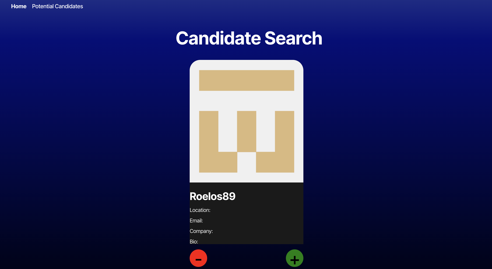
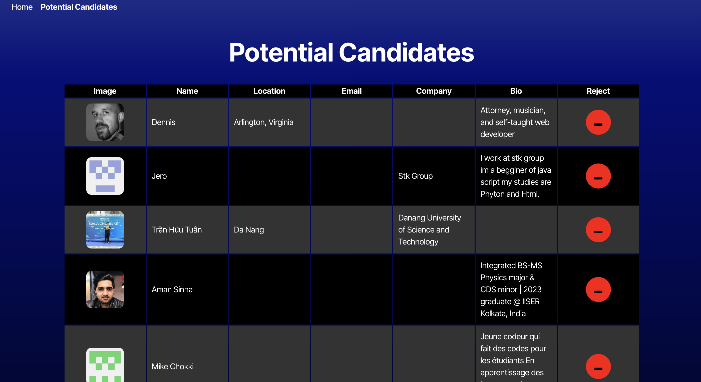

# Candidate Search

## Description

This project was to create a Candidate Search application that uses the github API to gather potential candidates, and then allows the user to save or reject the candidate and move onto the next. When a candidate is saved, the information gets saved to local storage which is then extracted on the Potential Candidates tab into a table of all of the potential candidates. Within this table, there is also an option to reject the candidate here aswell. 

This project used the github third party API to gather the candidates and React to develop the front end of the application.. 

## Screenshot of Application

## Link to Deployed Application

https://candidatesearch-w551.onrender.com/
